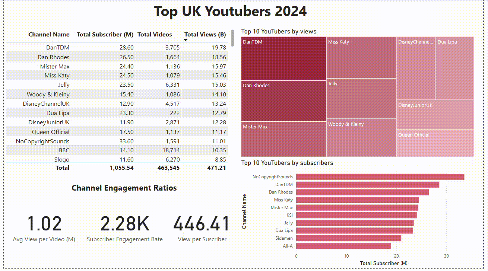

# Influencer Dashboard – Marketing Campaign Support
The Head of Marketing wants to identify the top YouTubers in 2024 to decide who would be the best candidates for upcoming marketing campaigns. The goal is to analyze UK-based creators based on metrics such as:

✅ Subscriber count
✅ Total views
✅ Total videos
✅ Engagement metrics

This dashboard aims to support marketing decision-making by providing quick, visual access to these key influencer performance indicators.
__________
# Real-Life Dashboard Development Process
 This version of the dashboard represents the initial baseline based on early requirements and my interpretation of what might help the Marketing team.
 In real-world scenarios, dashboard development is iterative and involves:
 - Collecting feedback from end-users
 - Observing how users interact with the solution
 - Identifying what is useful, missing, or confusing
 - Refining the dashboard based on user experience and business needs
________________________
# Future Improvements & Interactivity (Work in process ... )
Power BI offers powerful interactive features that can enhance decision-making further. Future versions of the dashboard could introduce variables such as:
- Conversion Rate
- Product Cost
- Campaign Budget
These enhancements would enable marketing professionals to interact with sliders and dynamic parameters to explore different marketing scenarios
___________________
# Current Demo

